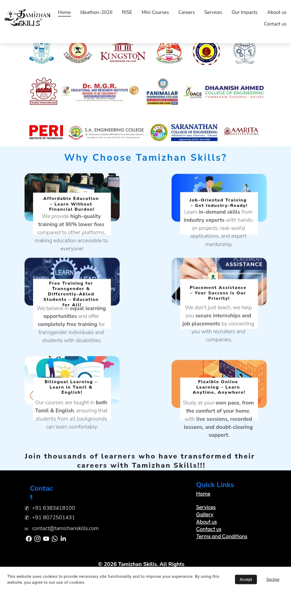
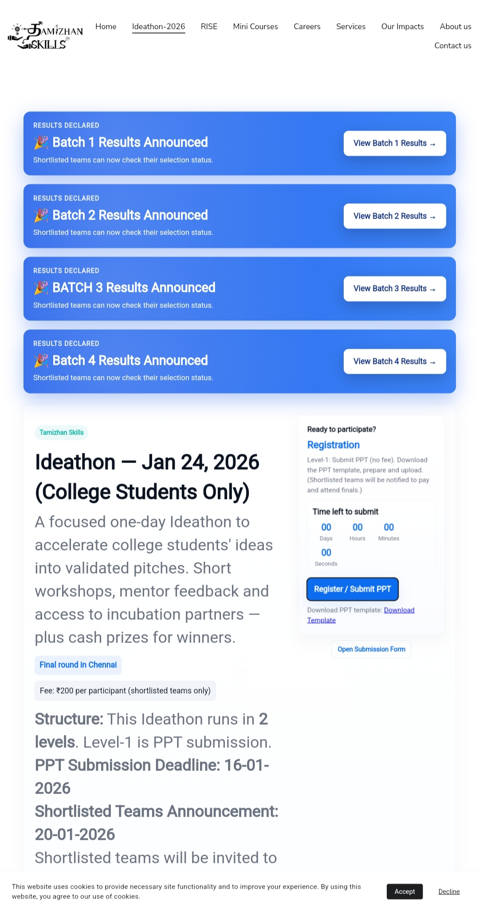

# Sample Web Portal

A responsive web portal developed using HTML, CSS, and JavaScript.

## Features
- Responsive UI
- Interactive web pages
- Smooth navigation
- User-friendly design

## Technologies Used
- HTML
- CSS
- JavaScript

## Project Preview

